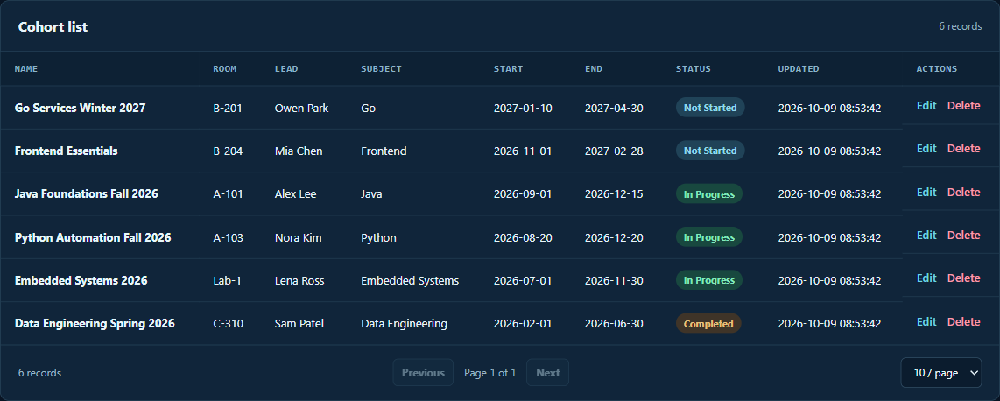
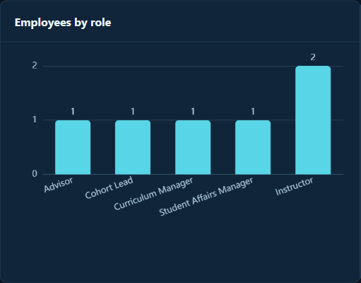

# CohortDesk

A full-stack training operations dashboard for managing cohorts, learners, employees, departments, and reports.

Maintained by [tiancaiq](https://github.com/tiancaiq).

> **Project origin:** CohortDesk is an English-language adaptation of the Tlias application from the 2024 Heima Java Web course. The frontend was subsequently rewritten in React, with a new dashboard, password-change flow, additional reporting, validation, and exception handling. This is a local demo, not a production deployment.

## Demo

This demo runs locally. Follow [Run locally](#run-locally), then open `http://127.0.0.1:5173/login`.

| Username | Password |
| --- | --- |
| `linchong` | `123456` |

### Cohort table



### Employee role graph



[View dashboard](assets/demo/cohortdesk-dashboard.png) · [View cohort page](assets/demo/cohortdesk-cohorts.png) · [View full analytics page](assets/demo/cohortdesk-analytics.png)

The included English seed starts with 5 departments, 6 employees, 6 cohorts, and 12 learners. All names and activity in the seed are synthetic.

### Take a quick tour

1. **Dashboard:** Open the six work areas from the home screen.
2. **Cohorts and learners:** Browse cohorts, inspect their dates and leads, then filter and page through learner records.
3. **Employees and departments:** View staff profiles, work experience, and department assignments.
4. **Analytics:** Compare employee roles and learner enrollment in the report charts.
5. **Activity:** Inspect login attempts and operation logs. Changes made in the demo appear in the operation log.

### Try the API

With the backend running, this PowerShell example signs in and lists the seeded employees:

```powershell
$session = Invoke-RestMethod -Uri 'http://127.0.0.1:8081/login' -Method Post -ContentType 'application/json' -Body '{"username":"linchong","password":"123456"}'
$employees = Invoke-RestMethod -Uri 'http://127.0.0.1:8081/emps/list' -Headers @{ token = $session.data.token }
$employees.data | Select-Object name, username
```

On a fresh seed, the response contains six employees. See the [API reference](assets/documents/api-reference.md) for more endpoints.

## What it does

- Sign in and manage departments and employees.
- Create cohorts, assign a cohort lead, and manage learners.
- Filter and page through records.
- Review employee and learner charts, login activity, and operation logs.
- Change the signed-in employee's password.

## Technology

| Layer | Tools |
| --- | --- |
| Backend | Java 21 target, Spring Boot 3.5, MyBatis, Maven |
| Database | MySQL 8 |
| Frontend | React 19, React Router 7, Vite 8, Axios, ECharts |
| File upload | Aliyun OSS integration (optional credentials required) |

## Run locally

The English demo database is separate from the original database. Its name is `cohortdesk_demo`, and the seed file contains synthetic names and activity.

### 1. Start MySQL

With Docker Desktop running:

```powershell
docker run --name cohortdesk-mysql -e MYSQL_ROOT_PASSWORD=123456 -p 127.0.0.1:3306:3306 -d mysql:8.4
docker cp assets/database/cohortdesk-demo.sql cohortdesk-mysql:/tmp/cohortdesk-demo.sql
docker exec -e MYSQL_PWD=123456 cohortdesk-mysql mysql -uroot -e "source /tmp/cohortdesk-demo.sql"
```

If the container already exists, run `docker start cohortdesk-mysql`. The seed script is intended for a new `cohortdesk_demo` database and should only be imported once.

### 2. Build and start the backend

Install a JDK of version 21 or newer. From the repository root:

```powershell
./cohortdesk-api/mvnw.cmd -f pom.xml -DskipTests clean package
java -jar cohortdesk-api/target/app.jar
```

The API listens on `http://127.0.0.1:8081`. Database settings are in `cohortdesk-api/src/main/resources/application.yaml`.

### 3. Start the frontend

In a second terminal:

```powershell
cd frontend
npm ci
npm run dev
```

Open `http://127.0.0.1:5173/login`.

Use the credentials in [Demo](#demo).

The frontend proxies `/api` requests to the backend on port 8081.

## Project structure

- `cohortdesk-api/`: controllers, services, MyBatis mappers, logging, and configuration
- `cohortdesk-model/`: entities, request objects, and response objects
- `cohortdesk-util/`: JWT and Aliyun OSS helpers
- `frontend/`: React application
- `assets/database/cohortdesk-demo.sql`: synthetic English-language MySQL seed
- `assets/documents/api-reference.md`: API endpoint reference

## Current limitations

This remains a local learning project. Passwords in the demo database are stored in plain text, and the authentication and logging code require security work before any public deployment. Avatar uploads require `OSS_ACCESS_KEY_ID` and `OSS_ACCESS_KEY_SECRET` plus a valid Aliyun OSS bucket. The current interface also retains the original demo's field model, including some fields specific to its course setting.

The `assets/prototype` directory and original `Tlias-*` demo media remain as legacy course artifacts. They are not used by the running application and still contain Chinese text. The screenshots above show the current English React app.

## License

See [LICENSE](LICENSE).
